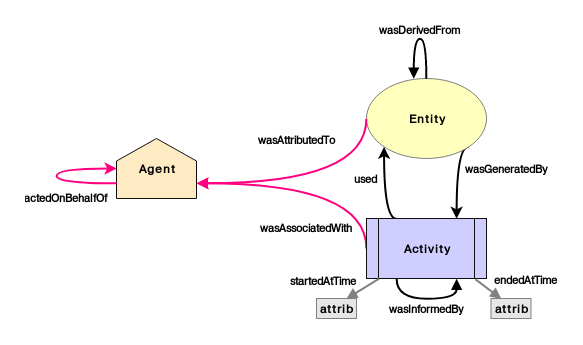

# diagrams and figures for semantic web
Providing reusable diagrams and figures for the semantic web domain.
See [list of available diagrams online](https://coolharsh55.github.io/semweb-diagrams/).

## Formats/Services
* [draw.io](https://www.draw.io/)
* [graphviz](https://graphviz.gitlab.io/)

## License
Work released in the public domain (see unlicense).

## Structure of repository
Each top-level folder represents one set of diagrams, whether for an ontology or
for a project. Within that folder, there are sub-folders for each supported service,
such as draw.io and graphviz. Pull requests are welcome to add more components
and services.

## How to use
### draw.io
* These diagrams are in the draw.io folder
* Method 1: File -> Open Library From... will add all figures in library (collection) in the sidebar. These are the files with the `lib-ooo.xml` format.
* Method 2: File -> Import From... choose one of the individual figures or example files

### graphviz
* These diagrams are in the graphviz folder
* Copy the code in DOT (.dot) files and render using any supported mechanism.

## Diagrams/Figures

[PROV](https://www.w3.org/TR/prov-o/)

